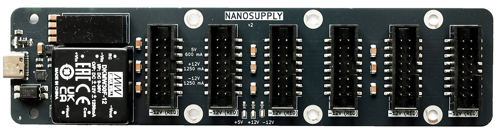
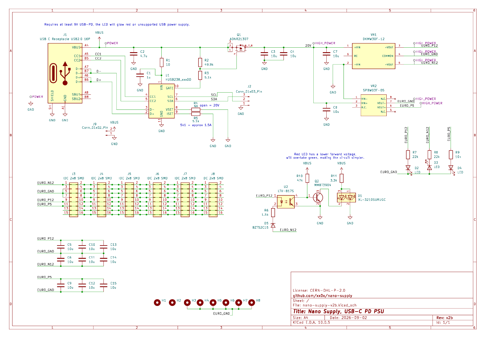

# Nano Supply
Compact open source Eurorack USB-C power supply. Uses USB-PD and requires at least **9V**; should work with most USB-C *fast chargers* for phones and laptops.

Lights red on unsupported USB charger, and green when all is OK.

## Specs

- up to 1250 mA @ +12V
- up to 1250 mA @ -12V
- up to 600 mA @ +5V
  
## How it looks? 

## Schematics

## How to get it?

You can find gerber/BOM/CPL files inside `pcb/nano-supply-v2b/jlcpcb/production_files`, the Nano Supply is not available for purchase neither as a kit or built unit at the moment.

## License

CERN-OHL-P-2.0